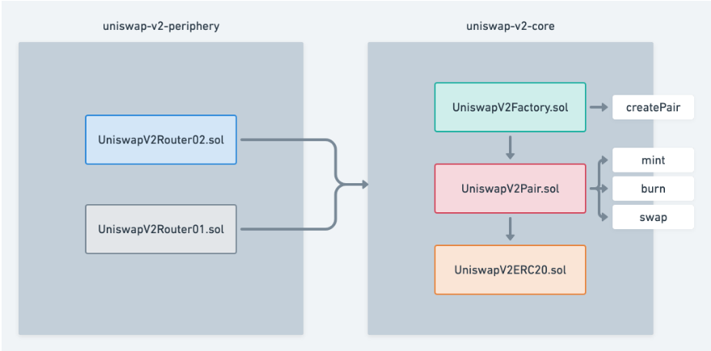

# Uniswapv2

Uniswap v2 的合约主要分为两类： core 和 periphery 合约，其中core合约仅包含最基础的交易功能，仅仅200行，由于用户资金都存储在core合约里，因此需要保证core合约最简化，避免引入bug；periphery合约则针对用户使用场景提供多种封装方法，比如支持原生ETH交易（自动转为WETH），多路径交换（一个方法同时执行A→B→C交易）等，其底层调用的是core合约。我们在[app.uniswap.org](https://app.uniswap.org/#/swap)界面操作时用的就是periphery合约。

我们先介绍几个主要合约的功能：

* uniswap-v2-core
  * UniswapV2Factory：工厂合约，用于创建Pair合约（以及设置协议手续费接收地址）
  * UniswapV2Pair：Pair（交易对）合约，定义和交易有关的几个最基础方法，如swap、mint、burn，价格预言机等功能，其本身是一个ERC20合约，继承UniswapV2ERC20
  * UniswapV2ERC20：实现ERC20标准方法
* uniswap-v2-periphery
  * UniswapV2Router02：最新版的路由合约，相比UniswapV2Router01增加了对FeeOnTransfer代币的支持；实现Uniswap v2最常用的接口，比如添加、移除流动性，使用代币A交换代币B，使用ETH交换代币等
  * UniswapV1Router01：旧版本Router实现，与Router02类似，但不支持FeeOnTransferTokens，目前已不使用
